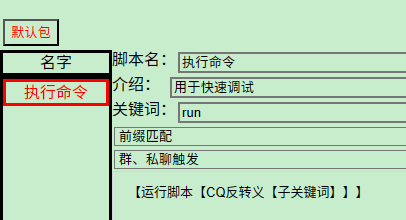

## 调试脚本的方法(重要)

> 红色问答倾向于使用真实的聊天平台环境来调试。

1. 创建如下图这样的一个脚本：


```
【运行脚本【CQ反转义【子关键词】】】
```

2. 然后，在您的聊天平台，发送如下信息：


```
run【循环@5@hello【空格】】
```

3. 然后，您会看到如下的效果：


## 访问网络图片

#### 代码
```
【图片【取元素【json解析【访问@https://api.gumengya.com/Api/DmImg】】@data@url】】
```

#### 解释
* [【访问】](/detailref/?id=访问)命令访问了一个网站，得到了json格式的字节集

* [【json解析】](/detailref/?id=json解析)命令解析了字节集，得到了Redlang对象

* [【取元素】](/detailref/?id=取元素)命令取了Red对象中的data->url字段，即图片链接

* [【图片】](/detailref/?id=图片)命令，构造了一张图片。【图片】命令，其实是输出了平台支持的特殊格式的文本，您如果对此感到好奇，可以使用[【打印日志】](/detailref/?id=打印日志)命令查看。

## 如何向指定目标发送消息

消息来源决定回复目标。

在聊天事件中，回复会自动根据消息来源，发送到群聊或私聊中。

但是在定时任务、框架初始化事件中，没有消息来源。所以需要使用[【设置来源】](/detailref/?id=设置来源)命令。

#### 定时器中发送群聊消息

```
【设置来源@机器人平台@onebot11】
【设置来源@机器人ID@xxxxx】
【设置来源@群ID@920220179】
```

#### 定时器中发送私聊消息

```
【设置来源@机器人平台@onebot11】
【设置来源@机器人ID@xxxxx】
【设置来源@发送者ID@1875159423】
```

#### 在群聊中发送私聊消息
将群ID清空，就可以进行私聊回复了。
```
【设置来源@群ID@】
```

## 多条回复

如果希望对同一条消息进行多次回复，有两种办法。

#### 分页
使用[【分页】](/detailref/?id=分页)命令发送`你好`和`世界`两条消息。

```
你好【分页】世界
```

#### 输出流
使用[【输出流】](/detailref/?id=输出流)命令发送`你好`和`世界`两条消息。

```
【隐藏【输出流@你好】】
【隐藏【输出流@世界】】
```
【输出流】会返回消息ID，这里用不到，所以使用[【隐藏】](/detailref/?id=隐藏)命令将返回的消息ID隐藏起来。

## 获取事件内容

如果需要获取消息事件中的消息，最方便的方法是使用[【子关键词】](/detailref/?id=子关键词)。

如果要获取一个事件中的所有内容，比如您希望获得事件产生的时间，您可以使用【取元素【事件内容】@time】，如果您不了解【事件内容】的结构，您可以使用【转文本【事件内容】】，将其输出出来观察。

## 数据类型转换

红色问答中支持`文本`，`字节集`，`数组`，`对象`这四种数据类型，然而可以输出的只有`文本`类型，所以，您需要使用[【转文本】](/detailref/?id=转文本)命令。

#### 文本转文本

```
【转文本@你好】
```
输出```"你好"```，其实就是输出了json形式的文本，这在您需要手拼json的时候非常管用。

#### 字节集转文本

```
【转文本【读文件@C://test.txt】@utf8】
```
读utf8格式的文本文件，得到的结果是字节集，然后转为文本。utf8是默认的，可以省略，如`【转文本【读文件@C://test.txt】】`，也可以是gbk，如`【转文本【读文件@C://test.txt】@gbk】`。

#### 文本转字节集
[【转字节集】](/detailref/?id=转字节集)命令可以实现将文本转为字节集。

```
【转字节集@你好@utf8】
```
utf8是默认的，表示字节集类型，可以省略，如`【转字节集@你好】`，也可以是gbk，如`【转字节集@你好@gbk】`。

#### 字节集转文本

```
【转文本@你好@utf8】
```

#### 数组转文本

```
【转文本【数组@1@2@3】】
```
输出`["1","2","3"]`，其实就是输出了json形式的文本。因为json中是不支持字节集的，所以你需要保证数组中没有字节集类型。

#### 数组转文本

```
【转文本【对象@1@a@2@b@3@c】】
```
输出`{"1":"a","2":"b","3":"c"}`，其实就是输出了json形式的文本。因为json中是不支持字节集的，所以你需要保证对象中没有字节集类型。
